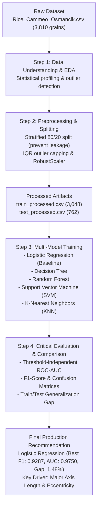

# IT3091 Machine Learning: Rice Variety Classification & Quality-Control Decision Support

[](https://github.com/pubudini-rathnayake/2026-DS-04K)
[](https://github.com/pubudini-rathnayake/2026-DS-04K)
[](https://github.com/pubudini-rathnayake/2026-DS-04K)
[](https://archive.ics.uci.edu/dataset/545/rice+cammeo+and+osmancik)
[](https://www.python.org/)
[](LICENSE)

---

## 📌 Executive Summary & Business Problem Framing

In the commercial grain and rice processing industry, purity and variety consistency directly determine market value, cooking characteristics, and customer satisfaction. The **Cammeo** and **Osmancik** rice cultivars exhibit distinct commercial price points and culinary attributes, yet manual visual inspection during high-throughput milling is labor-intensive, slow, and error-prone.

* **Target Stakeholder**: Quality Control (QC) Engineers and Production Plant Managers at Agricultural Milling Facilities.
* **Decision Need**: Automate real-time grain classification on sorting lines to detect batch contamination, maintain grading standards, and reduce manual sorting overhead.
* **Primary Decision Lens**: **Variety Classification** (Binary supervised classification of individual grain instances into Cammeo vs. Osmancik).
* **Secondary Decision Lens**: **Feature-Importance Analysis & Quality-Control Decision Support** (Identifying which morphological features provide the strongest discriminant signal to optimize optical hardware sensors).
* **Unit of Analysis**: An individual photographed rice grain characterized by seven morphological measurements.
* **Target Output**: Probability and discrete classification of grain variety (`0: Cammeo`, `1: Osmancik`) paired with feature explainability.

---

## 👥 Group Members & Responsibilities (Group: 2026-DS-04K)

| Member | Role & Responsibility | Core Contributions & Deliverables |
| :--- | :--- | :--- |
| **Member 1** | Data Understanding & EDA | Dataset ingestion, statistical profiling, distribution analysis, outlier detection, and exploratory visualizations. |
| **Member 2** | Preprocessing & Pipeline Design | Missing value verification, IQR outlier capping, RobustScaler transformation, label encoding, and stratified train/test split. |
| **Member 3 ** | Model Building & Architecture | Baseline model formulation, selection & implementation of 5 ML architectures (Logistic Regression, Decision Tree, Random Forest, SVM, KNN), and artifact serialization. |
| **Member 4** | Evaluation, Comparison & Recommendation | Multidimensional model evaluation (Accuracy, F1, ROC-AUC, Confusion Matrices, Overfitting Gap analysis), feature importance synthesis, and stakeholder recommendations. |

---

## 🗺️ End-to-End Workflow Architecture



---

## 📊 Dataset Dictionary & Statistical Profiles

The dataset comprises **3,810 instances** of Turkish rice varieties (1,630 Cammeo [42.8%], 2,180 Osmancik [57.2%]) extracted from high-resolution imagery:

| Feature | Data Type | Physical Meaning / Description | Preprocessing Applied |
| :--- | :--- | :--- | :--- |
| `Area` | Continuous (Float) | Total pixel area enclosed by the grain boundary. | Outlier capping (IQR) + RobustScaler |
| `Perimeter` | Continuous (Float) | Circumference length of the grain perimeter. | Outlier capping (IQR) + RobustScaler |
| `Major_Axis_Length` | Continuous (Float) | Longest dimension / major axis of the best-fit ellipse. | Outlier capping (IQR) + RobustScaler |
| `Minor_Axis_Length` | Continuous (Float) | Shortest dimension / minor axis of the best-fit ellipse. | Outlier capping (IQR) + RobustScaler |
| `Eccentricity` | Continuous (Float) | Roundness vs. elongation metric ($e = \sqrt{1 - b^2/a^2}$). | Outlier capping (IQR) + RobustScaler |
| `Convex_Area` | Continuous (Float) | Area of the smallest convex polygon enclosing the grain. | Outlier capping (IQR) + RobustScaler |
| `Extent` | Continuous (Float) | Ratio of grain area to its bounding box area ($Area / BoundingBox$). | Outlier capping (IQR) + RobustScaler |
| `Class` | Categorical (Target)| Grain variety (`Cammeo` vs. `Osmancik`). | Binary Encoded (`Cammeo`: 0, `Osmancik`: 1) |

---

## 🔬 Preprocessing & Data Leakage Prevention Log

* **No Data Leakage**: Train/Test partition (80/20 stratified split) was established **strictly before** any transformations. Scaler parameters and outlier bounds were computed solely on the training set and applied downstream to the test set.
* **Outlier Strategy**: Extreme values outside 1.5 $\times$ IQR were capped (Winsorized) at the 5th and 95th percentiles to preserve sample size while stabilizing gradient-based and distance-based estimators.
* **Feature Scaling**: `RobustScaler` was selected over `StandardScaler` to minimize the influence of extreme grain dimension variances.
* **Target Balance**: Stratified splitting ensured a consistent 57.2% Osmancik / 42.8% Cammeo distribution across both partitions.

---

## 📈 Model Performance & Comparative Benchmark

Five distinct machine learning paradigms were trained on identical training sets and benchmarked on the unseen test set (762 samples):

| Model Architecture | Test Accuracy | Precision | Recall | Test F1-Score | ROC-AUC | Train Acc. | Generalization Gap |
| :--- | :---: | :---: | :---: | :---: | :---: | :---: | :---: |
| **Logistic Regression (Baseline)** | **0.9173** | **0.9172** | **0.9404** | **0.9287** | **0.9750** | **0.9321** | **0.0148 (Best)** |
| **Random Forest** | 0.9160 | 0.9097 | 0.9472 | 0.9281 | 0.9710 | 1.0000 | 0.0840 (Overfit) |
| **Decision Tree** | 0.9121 | 0.9261 | 0.9197 | 0.9229 | 0.9630 | 0.9446 | 0.0325 |
| **Support Vector Machine (SVM)** | 0.9108 | 0.9089 | 0.9381 | 0.9233 | 0.9565 | 0.9350 | 0.0243 |
| **K-Nearest Neighbors (KNN)** | 0.9094 | 0.9124 | 0.9312 | 0.9217 | 0.9491 | 0.9373 | 0.0279 |

---

## 💡 Key Findings & Stakeholder Recommendation

1. **Production Winner — Logistic Regression**:
   * Achieved the highest test **F1-score (0.9287)** and **ROC-AUC (0.9750)** across all candidates.
   * Demonstrates the lowest generalization gap (**1.48%**), compared to Random Forest's **8.40%** gap (which memorized training noise).
   * Negligible latency and computational footprint, ideal for real-time edge integration on sorting conveyor cameras.
2. **Discriminant Signal — Elongation over Size**:
   * Feature importance analysis confirms that **`Major_Axis_Length`** and **`Eccentricity`** are the dominant predictors.
   * Cammeo grains are systematically longer and more elongated, whereas Osmancik grains are rounder and more compact. Optical sorting sensors should prioritize longitudinal resolution over total area sensors.

---

## ⚠️ Real-World Limitations & Responsible AI Considerations

* **Controlled Imaging Artifacts**: The model was trained on uniform, isolated grain silhouettes; real-world conveyor systems encounter overlapping grains, dust, and broken grain fragments.
* **Single Train/Test Partition**: While stratified, k-fold cross-validation should be incorporated in future iterations to quantify variance across seasonal harvests.
* **Hyperparameter Tuning Scope**: Default and heuristically selected hyperparameters were utilized; Bayesian optimization or Grid Search could yield marginal gains.

---

## 📁 Repository Structure

```text
├── Rice_Cammeo_Osmancik.csv                       # Raw source dataset
├── Data_Understanding_and_EDA.ipynb               # Member 1: Exploration, data profiling & distribution plots
├── preprocessing/                                 # Member 2: Data preparation pipeline
│   ├── Train_Test_Split_+_Preprocessing.ipynb    # Leakage-free preprocessing, scaling, and splitting
│   ├── train_processed.csv                       # Scaled, processed training subset (3,048 rows)
│   ├── test_processed.csv                        # Scaled, processed testing subset (762 rows)
│   └── label_encoder.pkl                         # Target label encoder artifact
├── model_building/                                # Member 3 (Team Leader): Model development
│   ├── Modeling.ipynb                             # Implementation of 5 ML architectures
│   └── outputs/                                   # Serialized model binaries (.pkl)
│       ├── model_logistic_regression.pkl
│       ├── model_decision_tree.pkl
│       ├── model_random_forest.pkl
│       ├── model_svm.pkl
│       └── model_knn.pkl
├── Evaluation_+_Comparison_+_Recommendation.ipynb # Member 4: Benchmark, ROC curves & stakeholder insights
├── visualizations/                                # Generated high-resolution diagnostic plots
│   ├── Class-Balance.png
│   ├── Feature-Distributions.png
│   ├── Correlation-Heatmap-between-Features.png
│   ├── Feature-Relationships-with-the-Target.png
│   ├── Outliers.png
│   ├── Confusion-Matrices.png
│   ├── Feature-Importance.png
│   └── ROC-Curves.png
└── README.md                                      # Comprehensive project documentation
```

---

## 🚀 Setup & Execution Guide

```bash
# 1. Clone this repository
git clone https://github.com/pubudini-rathnayake/2026-DS-04K.git
cd 2026-DS-04K

# 2. Set up virtual environment
python -m venv venv
venv\Scripts\activate  # Windows (or source venv/bin/activate on Unix)

# 3. Install required packages
pip install numpy pandas scikit-learn matplotlib seaborn jupyter

# 4. Launch Jupyter Notebook
jupyter notebook
```

---

## 🤖 AI-Use & Academic Transparency Declaration

* Generative AI (LLMs) was utilized in accordance with academic integrity guidelines for code scaffolding, documentation structuring, and diagnostic troubleshooting.
* All architectural decisions, data interpretations, statistical validations, and final business recommendations were critically evaluated, verified, and authored by the group members.
